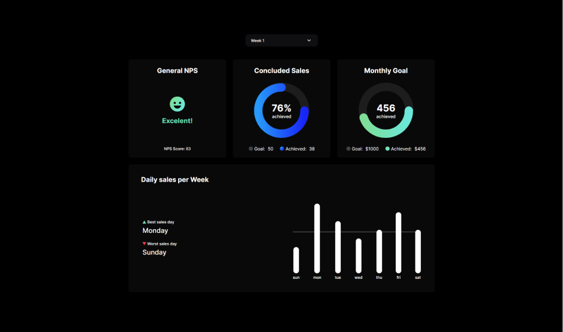

<h1 align="center"> BoraCodar #08 </h1>

Dashboard

  <a href="#-tecnologias">Tecnologias</a>&nbsp;&nbsp;&nbsp;|&nbsp;&nbsp;&nbsp;
  <a href="#-projeto">Projeto</a>&nbsp;&nbsp;&nbsp;|&nbsp;&nbsp;&nbsp;
  <a href="#-layout">Layout</a>&nbsp;&nbsp;&nbsp;|&nbsp;&nbsp;&nbsp;

 

  

## 🚀 Tecnologias

Esse projeto foi desenvolvido com as seguintes tecnologias:

- HTML e CSS
- [ReactJS](https://reactjs.org/)
- [Node e NPM](https://nodejs.org/)
- [Vite](https://vitejs.dev/)
- [iMask](https://imask.js.org)

## 💻 Projeto

Dashboard com o objetivo de monitorar as vendas de uma empresa. O Dashboard mostra o NPS, quantidade de vendas semanais e o faturamento. 

## 🔖 Layout

Você pode visualizar o layout do projeto através [DESSE LINK](https://www.figma.com/file/HgSigYR6RY4gJ3u71lALdR/%23boraCodar---Desafio-8-(Community)?node-id=7%3A3&t=QxoC2ZgeFDbJXTOO-1).

